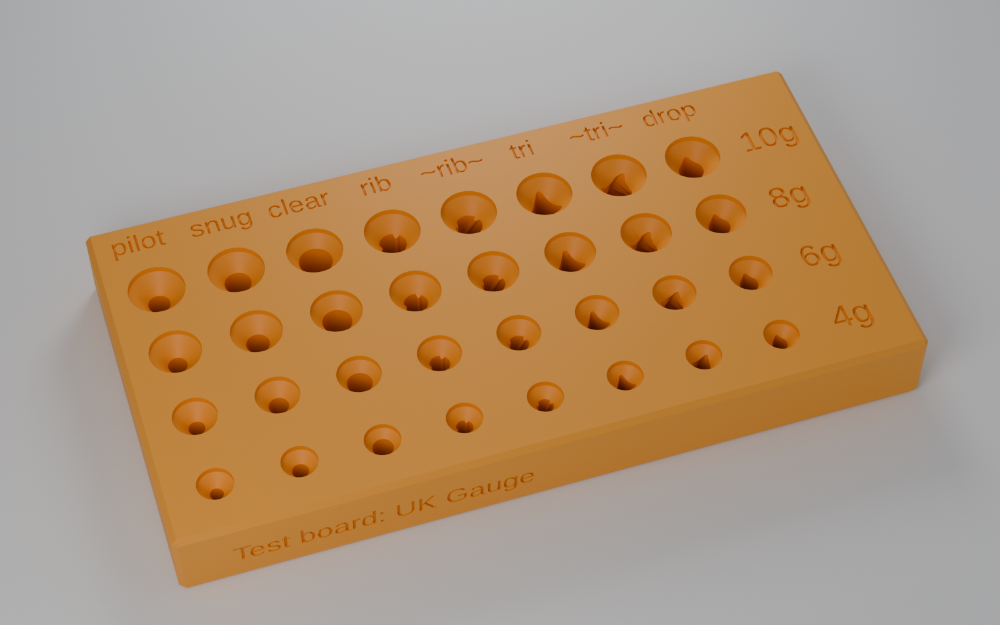
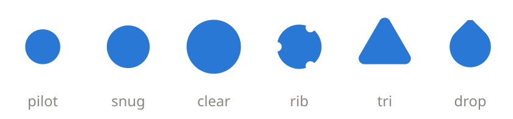
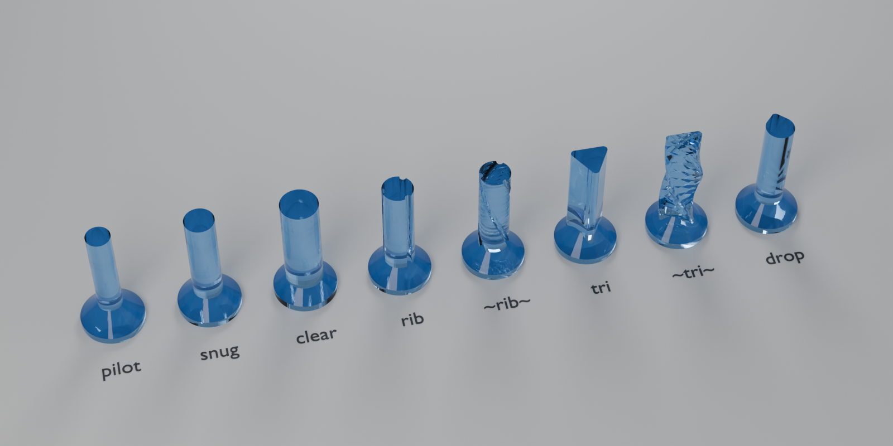
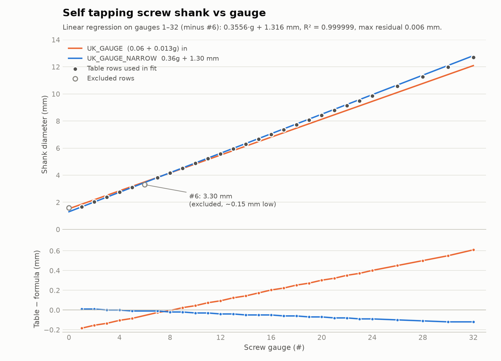

# screw_it

[](LICENSE)
[](https://github.com/busyDuckman/screw_it/commits)
[](https://github.com/busyDuckman/screw_it/stargazers)
[](https://openscad.org)
[](https://github.com/BelfrySCAD/BOSL2)

An [OpenSCAD](https://openscad.org) library for self tapping screw holes in 3D prints, built on [BOSL2](https://github.com/BelfrySCAD/BOSL2).   
It's about making better screw holes (in my opinion anyway).


## Why yet another screw library?

- I needed better tolerances for common brand self tapping screws.
- I wanted more complex hole geometry.
- Existing libs were not sparking joy, so I wanted to dial in my own settings.
- It seemed like a fun thing to do.

> [!NOTE]
> Common brand name screws seem to be a bit off from the UTS standard. I called this type **SCREW_UNIT_UK_GAUGE_NARROW** in this library.

 **Why:** My guess is that manufacturers who specify a metric pilot hole tweak the sizes to fit metric drills. Either way, the holes didn't always fit, so this library has a second size model fitted to what I could actually measure.


**Note:** I don't live in the US, I don't know if that effects who needs this or not.



<sub>The test board (examples/test_board.scad)</sub>

## Quick start

Install [BOSL2](https://github.com/BelfrySCAD/BOSL2#installation), then copy screw_holes.scad to your project dir.


First define a screw_type based on what you are using, these match the labeling on most hardware shop packets. use: UNIT + HEAD + TYPE, where:
  - **Unit:** SCREW_UNIT_UK_GAUGE + SCREW_UNIT_UK_GAUGE_NARROW  
  - **Head:** SCREW_HEAD_COUNTERSUNK, SCREW_HEAD_FLAT, SCREW_HEAD_SOCKET, SCREW_HEAD_NONE
  - **Type:** SCREW_FOR_HINGE, SCREW_FOR_METAL, SCREW_FOR_SOFT_WOOD, SCREW_FOR_HARD_WOOD
  
  
```openscad
include <BOSL2/std.scad>
include <screw_holes.scad>

#            Just match the type of screw you bought
#            UNIT                         HEAD                     TYPE      
screw_type = SCREW_UNIT_UK_GAUGE_NARROW + SCREW_HEAD_COUNTERSUNK + SCREW_FOR_SOFT_WOOD;

difference() {
    cuboid([60, 20, 6], anchor=TOP, rounding=2, edges="Z");

    self_tap_hole(gauge=8, length=25, screw_type=screw_type,
                  hole_type=HOLE_TRI_TWIST, anchor=TOP, sink=0.5);
}
```

## Hole types

<p align="center"></p>

| Constant | Shape | Use |
|---|---|---|
| `HOLE_PILOT` | pilot hole | The screw cuts its own thread. |
| `HOLE_SNUG` | hol sits halfway between shank and thread | General. |
| `HOLE_CLEARANCE` | 1.2 x thread + 0.1 mm | The screw passes straight through. |
| `HOLE_RIBBED` | 3 ribs for the thread to bite.  | Delicate prints. |
 `HOLE_RIBBED_TWIST`, | as above, twisted | better grip. |
| `HOLE_TRI` | rounded triangle, pilot dia inscribed | General. |
| `HOLE_TRI_TWIST` | as above, twisted  | reduced stress points. |
| `HOLE_DROP` | capped teardrop | Horizontal holes without supports. |


# Cutting volume 


I personally use HOLE_TRI_TWIST most often, or HOLE_DROP for horizontal holes.


## Sizing

<picture>
  <source media="(prefers-color-scheme: dark)" srcset="docs/img/regression_dark.png">
  
</picture>

There are two shank models:

- **SCREW_UNIT_UK_GAUGE** is the standard formula, (0.06 + 0.013*g) inches.
- **SCREW_UNIT_UK_GAUGE_NARROW** is 0.36*g + 1.30 mm.

Machinist tables online vary. One of them, [The Vintage Screw Company's](https://www.thevintagescrewcompany.com/screw-size-guide/), matched my measurements very closely, so NARROW is a linear regression of that table ([tools/fit_gauge.py](tools/fit_gauge.py)). Some notes on the fit:

- Over #1-#32 it gives 0.3556*g + 1.316 mm (R^2 = 0.999999), which I rounded.
- I left out #6 (3.30 mm, where the line says 3.45), possibly a typo in the table?
- The rounding costs at most 0.05 mm up to #14.
- Despite the name, NARROW is only narrower than the standard formula below about #7.5.

Default hole sizes for UK_GAUGE + FOR_METAL, in mm:

| Gauge | Shank | Pilot | Snug | Clearance | Head dia |
|---:|---:|---:|---:|---:|---:|
| #4 | 2.84 | 2.42 | 2.96 | 3.79 | 6.5 |
| #6 | 3.51 | 2.98 | 3.65 | 4.64 | 8.0 |
| #8 | 4.17 | 3.54 | 4.33 | 5.50 | 9.5 |
| #10 | 4.83 | 4.10 | 5.02 | 6.35 | 10.5 |
| #12 | 5.49 | 4.66 | 5.71 | 7.21 | 12.0 |

**Note:** Heads are sized for the worst-ish case. Most are 2x the shank, but I've found some at 13/6, so I use that and round up to the next 0.5 mm.

## API

```openscad
self_tap_hole(gauge, length,
              hole_type  = HOLE_PILOT,
              sink       = 0,          // extra depth above the head (mm)
              screw_type = undef,      // sum of SCREW_* flags
              shank_dia, thread_dia, head_dia, head_h, pilot_dia,  // overrides
              anchor     = undef,      // TOP | BOTTOM | undef
              dilate_head = 0.1,
              $fn);                    // default: auto, edges <= 0.5 mm
```

It needs a length and either a gauge or a shank_dia. Anything you don't set is estimated. For screw_type, add one flag from each group:

| Group | Flags |
|---|---|
| Unit | `SCREW_UNIT_UK_GAUGE`, `SCREW_UNIT_UK_GAUGE_NARROW` |
| Head | `SCREW_HEAD_COUNTERSUNK`, `SCREW_HEAD_FLAT`, `SCREW_HEAD_SOCKET`, `SCREW_HEAD_NONE` |
| Type | `SCREW_FOR_HINGE`, `SCREW_FOR_METAL`, `SCREW_FOR_SOFT_WOOD`, `SCREW_FOR_HARD_WOOD` |

By default, z=0 means "top of the surface with the screw". anchor=TOP puts the top of the head (plus sink) at z=0, which is what you want for cutting into a part whose top face is at z=0.
